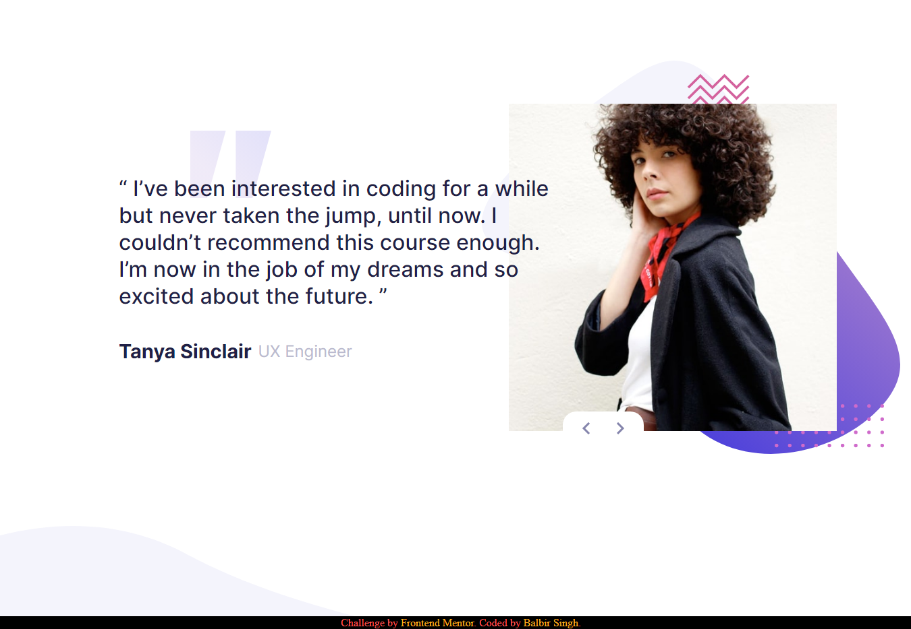
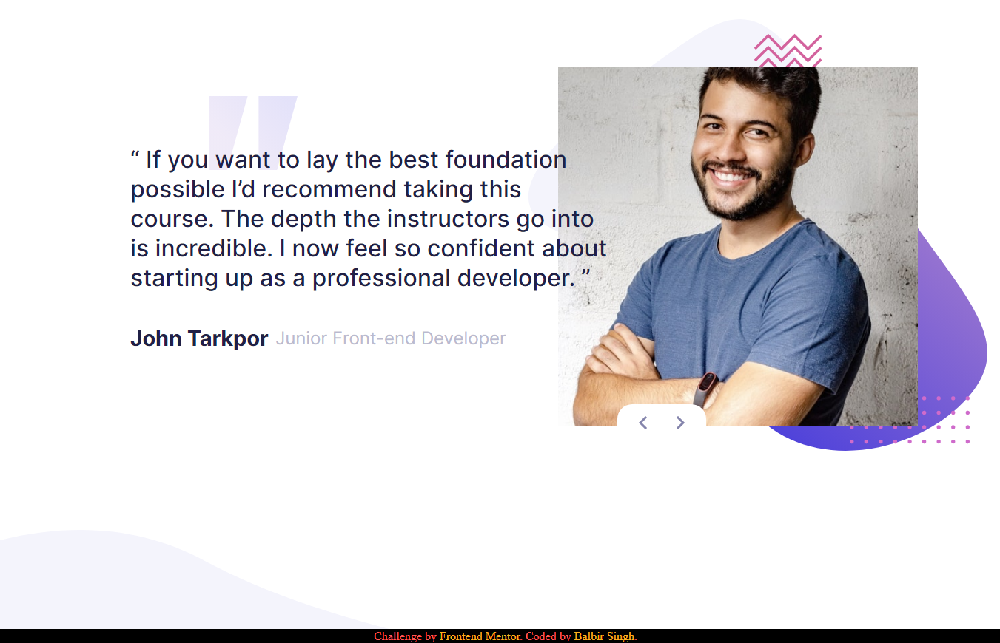

# Frontend Mentor - Coding bootcamp testimonials slider solution

This is a solution to the [Coding bootcamp testimonials slider challenge on Frontend Mentor](https://www.frontendmentor.io/challenges/coding-bootcamp-testimonials-slider-4FNyLA8JL). Frontend Mentor challenges help you improve your coding skills by building realistic projects.  
 

## Table of contents

- [Overview](#overview)
  - [The challenge](#the-challenge)
  - [Screenshot](#screenshot)
  - [Links](#links)
- [My process](#my-process)
  - [Built with](#built-with)
  - [Continued development](#continued-development)
- [Author](#author)

## Overview

### The challenge

Users should be able to:

- View the optimal layout depending on their device's screen size
- See hover and focus states for interactive elements

### Screenshot

### Links

- Solution URL:(https://github.com/balbir-25/coding-bootcamp-slider)
- Live Site URL:( https://balbir-25.github.io/coding-bootcam-slider/)

## My process

### Built with

- Semantic HTML5 markup
- CSS custom properties
- Flexbox
- JavaScript

### Continued development

Learn more about responsive design and there might much more to learn then I'm  expecting.

## Author

- Website - [Balbir Singh](http://balbir-portfolio.liveblog365.com/)
- Frontend Mentor - [@balbir-25](https://www.frontendmentor.io/profile/balbir-25)
- Linkedin - [@balbir singh](https://www.linkedin.com/in/balbir-singh-021819b6/)